# Introduction

This IoT skeleton, based on the Arduino Framework, leverages the [PlatformIO](http://platformio.org) cross-platform build system. It facilitates IoT network connectivity and includes functionality to illuminate a custom user LED through MQTT commands and provide the measured voltage on an analog pin as a usage example.

The project is compatible with and has been tested on various ESP8266 and ESP32-based controller boards. It is easily adaptable to many other controller boards, provided they support the Arduino/PlatformIO Framework and have WiFi capabilities.

## Intended Use

This project serves as a robust foundation for creating Arduino-based Internet of Things (IoT) applications.

## Features

 * *Configurable:* Easily configure the WIFI network and MQTT broker required for IoT functionality via the serial interface without recompiling and deploying the source code.
 * *Error Tolerant:* The device autonomously reconnects to a WIFI network or MQTT broker after a loss of connection without requiring a device reboot.
 * *CRC Data Protection:* Settings stored in the device's flash memory are protected by a 32-bit CRC.
 * *MVC Architecture:* The software is structured into the _model_ containing data used by the controller, the _view_ providing the text-based user interface (shell commands), and the _controller_, which manages functionality and integrates modules.
 * *Few Module Dependencies:* Software modules exhibit high independence from each other.  

## Short IoT introduction

The Internet of Things (IoT) refers to devices equipped with sensors or actuators capable of connecting to other devices over the internet. Each IoT device connects to an _MQTT broker_, an internet server responsible for collecting and forwarding messages to other devices.

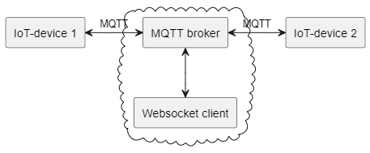

An example MQTT server which can be used for test purposes is [broker.hivemq.com](broker.hivemq.com) with the default TCP port 1883. A web interface for testing is available here: [MQTT browser client](https://www.hivemq.com/demos/websocket-client/).

### Providing information

An IoT device can send messages to a specific _topic_ to the broker, which then distributes the information. For instance, an IoT thermometer can provide measured temperature and humidity to the world.

### Receiving information

An IoT device can register topics of interest to receive relevant messages. The MQTT broker forwards messages with these topics from other devices to the subscribed device.


# Hardware

A configuration exists for the following boards: 

## nodemcu
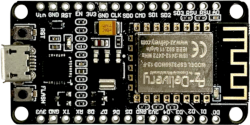

Az-Delivery: [ESP8266 NodeMCU Lua Amica Modul V2](https://www.az-delivery.de/products/nodemcu)

## d1_mini
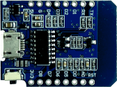

Az-Delivery: [ESP8266 D1 mini NodeMCU](https://www.az-delivery.de/products/d1-mini)

## esp32doit-devkit
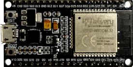

Az-Delivery: [ESP32 NodeMCU Dev Kit C V2](https://www.az-delivery.de/products/esp32-developmentboard)

## lolin32
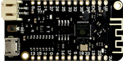

Az-Delivery: [LOLIN32 Lite V1.0.0](https://www.az-delivery.de/products/esp32-lolin-lolin32)

## Comparison and Pin-out

 |     | nodemcu | d1_mini | esp32doit-devkit | lolin32 |
 |-----|---------|---------|---------------------|---------|
 | size | 50 x 26 mm | 34 x 26 mm | 56 x 28 mm<br>(too large for<br>breadboard) | 50 x 26 mm |
 | CPU | ESP8266-12E | ESP8266-12F | ESP32 | ESP32 rev1 |
 | Cores | 1 | 1 | 2 | 2 |
 | max Speed | 80 MHz | 80 MHz | 240 MHz | 240 MHz |
 | LED WIFI | build-in,<br>D2 (inverted) | build-in,<br>D2 (inverted) | G22 | build-in,<br>22 (inverted) |
 | LED MQTT | build-in,<br>D16 (inverted) | D16 | G16 | 16 |
 | LED User1 | D5 | D5 | G5 | 5 |
 | Analog in | A0 | A0 | G32 | 32 |

The project could be easily ported to many other controller boards, as long as the Arduino/PlatformIO Framework is used and the controller is able to access WIFI.


# User Interface

To utilize the IoT device within a custom environment, essential configurations include setting up the WIFI network and specifying the MQTT broker need to be performed.

To initiate this setup, follow these steps:

1. *Driver Installation:*<br>
   Ensure the installation of the CP210x Universal Windows Driver on your computer. This driver is pivotal for establishing communication between the device and your computer via USB.

2. *Physical Connection:*<br>
   Connect the IoT device to your computer using a USB connection.

3. *Terminal Program Setup:*<br>
   Utilize a terminal program, such as HTerm, to facilitate configuration. Configure the terminal program with the following settings:
   * Baud Rate: 115200
   * Data Format: 8N1 (8 data bits, no parity bit, 1 stop bit)
   * Flow Control: None
   * Line Ending for Reception: \r\n
   * Command Termination: \r

## Setting up the WIFI connection 

To configure the WIFI network, use the follwing command:
```
set wifi <SSID> <password>
```
To connect to the configured network(s), use the following command:

```
wifi connect
```

Up to four networks can be configured. When a WIFI connection is requested, the device attempts to connect to the configured networks until a successful connection is established. 


## Setting up the MQTT connection

To configure the MQTT broker connection, use the follwing command:
```
set mqtt <broker>
```
To connect to the configured broker, use the following command:

```
mqtt connect
```

## Saving the configuration

The settings are not stored automatically. To persistently store the settings in flash, use the following command:

```
settings save
```


# MQTT message interface

MQTT operates on a publish/subscribe model, wherein messages are the central components, comprising a topic (for data categorization) and a payload (housing the actual information).

Upon establishing an MQTT connection to the broker, the initial message is sent, containing the device's UID under the topic `iotdevice`. This UID must be used to address the device when sending commands.

Example:
```json
{"uid":30973702185336}
```

In routine operation, the device measures the voltage on the analog input pin and transmits it, along with the device's UID, under the same `iotdevice` topic every 10 seconds. 

Example:
```json
{"uid":30973702185336,"analog":1.379633665}
```

To receive commands, the device subscribes to the `"iotdevice/<UID>/command"` topic on the broker. For demonstration purposes, the device supports the `setled` operation, allowing users to switch on the user LED with the following message:
```json
{"operation":"setled","number":0,"value":1}
```


# Software Architecture

The overarching software architecture adheres to the Model–View–Controller (MVC) design pattern.

> Model–view–controller (MVC) is a software design pattern commonly used for 
> developing user interfaces that divides the related program logic into 
> three interconnected elements. These elements are the internal representations 
> of information (the Model), the interface (the View) that presents information 
> to and accepts it from the user, and the Controller software linking the two.
> --- [Model-view-controller. (2023, November 20). In Wikipedia, The Free Encyclopedia. Retrieved 12:56, November 20, 2023](https://en.wikipedia.org/w/index.php?title=Model-view-controller)

In this context, the _Model_ is responsible for holding and storing configuration data in the internal flash memory of the ESP8266/ESP32 module using the Arduino framework.

The _View_ manages the user interface, encompassing both the text-based command interface on the RS232/USB port and the MQTT command interface. The View features a viewFacade, the sole class accessed by the controller. The viewFacade, in turn, utilizes the Shell library, providing shell commands and MQTT commands.

The _Controller_ offers a controllerFacade, the exclusive class accessed from the main function or the view. The controllerFacade initializes and utilizes the WIFI controller, MQTT controller, and the hardware controller, abstracting access to the actual hardware via the Arduino framework.

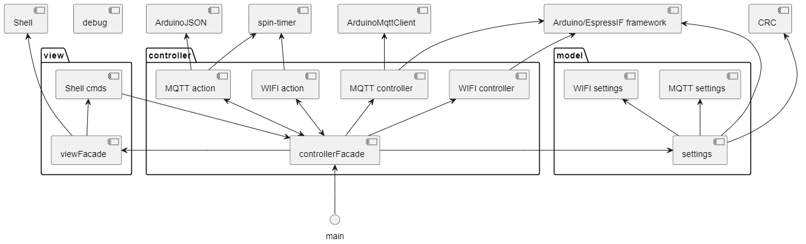


## Model

Within the _Model_, the pivotal component is the Settings class, serving as the facade for all storable settings in the device. The separation of WIFI and MQTT settings into distinct classes enhances modularity and clarity. These classes contain the configuration of the WIFI and MQTT controllers, each offering serialization and deserialization methods. This design ensures the Settings class can manage settings without delving into the internal structure of each.

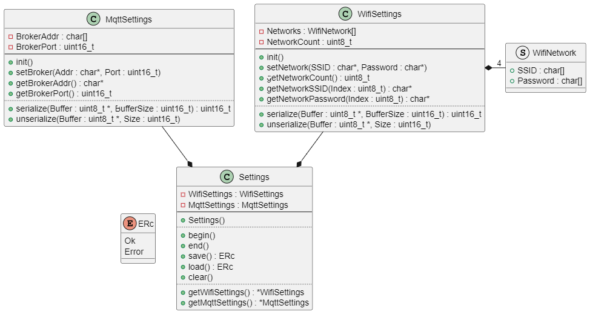

### Settings

The Settings class encompasses both WIFI and MQTT settings, providing methods for saving, loading, and clearing settings using the Arduino framework. Additionally, it supplies pointers to the WIFI and MQTT settings classes, directly utilized by the corresponding controllers.

### WIFI settings

The WIFI settings class serves as the storage unit for the WIFI controller, accommodating up to four WIFI networks with SSID and password. The priority of networks is determined by their index, with the most recently added having the highest priority. If more than four settings are added, the earliest networks are discarded.   

### MQTT settings

For the MQTT controller, the MQTT settings class serves as the storage entity, allowing configuration of the broker and port number (defaulting to 1883). 

### Data storage in flash

All settings are stored in flash, commencing with a magic number (`0x1ACFFC1D`) and a data version number. The WIFI settings, serialized by the WIFI settings class, precede the MQTT settings. The whole data settings section beginning with the version is protected by a CRC32. This approach ensures secure and organized storage of crucial device configurations.

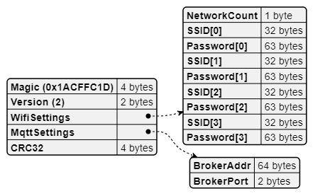


## View

The View component encompasses two key classes: one responsible for managing shell commands and another for interpreting and handling commands received through the MQTT protocol. Additionally, the View includes the viewFacade class, serving as the sole API accessed by the controller modules.

### View facade

The `ViewFacade` class offers an API for the controllers. It features a setup method to handle the registration of shell commands, a loop method for runtime actions needed for proper user interface functionality, and various callback functions essential for user interface interactions. Notably, the viewFacade provides a callback for handling incoming MQTT messages, along with general callbacks for the shell command interface (e.g., methods to display the shell prompt or return codes from shell commands). This modular approach ensures efficient and streamlined communication between the View and the controllers.

### Shell commands

The `ViewShellCommands` class serves as the container for available shell commands. The API design of these commands utilizes a familiar parameter mechanism, akin to the main function. Each command method takes the number of given parameters as the first argument, with the parameters provided as an array of character pointers (including the command name as the first parameter) as a second argument.

Example:
```c++
int cmdHelp(int argc, char *argv[]);
```

The character stream received from the serial interface within the viewFacades' loop method is forwarded to the external [shell library](https://github.com/steftri/shell). This library parses the input string, segments it into null-terminated parameter strings, and subsequently invokes the corresponding command callback.

### MQTT commands

The `ViewMqttComands` class serves as a container for operations requested by the MQTT command topic. Due to the MQTT library forwarding solely the content of received topics, this class also incorporates a parser, called by the callback method `onMqttTopicReceived` from the class `ViewFacade`. The parser's role is to initially extract the JSON-formatted message content and subsequently invoke the relevant command callback. 


## Controller


The _controller_ is responsible for maintaining the persistence of both WIFI and MQTT connections and cyclically executing voltage measurements on the analog input pin for demonstration purposes. Furthermore, the controller links to the _model_ (responsible for storing settings) and the _view_ (handling user interface interactions).


### Controller facade

The ControllerFacade class serves as the singular and easy-to-use API for the device. All device functionalities are encapsulated within this class through various methods, including those dedicated to configuring WIFI and MQTT. These methods are designed for simplicity, merely invoking the corresponding functions from the hardware controller, WIFI controller, or MQTT controller classes.

For convenient utilization, the class offers setup() and loop() methods, resembling the familiar structure of the Arduino framework. These methods are intentionally kept straightforward. The setup function involves loading settings, configuring the hardware, WIFI, and MQTT controllers, and initializing the WIFI connection if a WIFI network is configured. The loop method sequentially calls the respective loop methods in the hardware, WIFI, and MQTT controllers, reads the voltage on the analog pin, and initiates the publication of the measured value.


### WIFI controller

The WIFI controller adheres to the state machine design pattern. Within the main `WifiController` class, the implemented WIFI states—Idle, Connecting, Connected, and Error—are composed. All these states inherit from the interface class `WifiState`. The WIFI controller also maintains a WifiState pointer, representing the active state among the four. Wifi settings are stored in the `WifiSettings` class, a component of the model within the MVC architecture.

To facilitate a response to a state change, a WifiAction interface class is defined. Consequently, the Wifi controller has no dependencies except for the Arduino WIFI driver. For reacting to an established connection, the `WifiAction` class is implemented and communicated to the WIFI controller. This action class manages the control of the WIFI LED and initiates the MQTT connection.

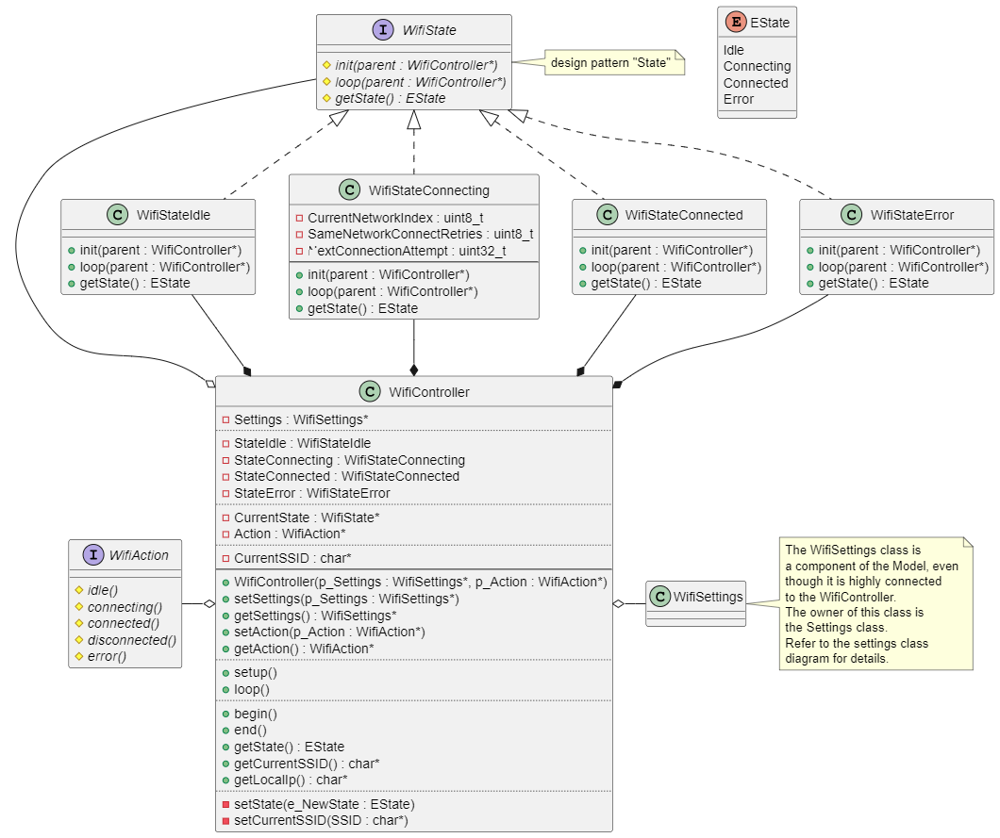

After the setup process, the WIFI controller state machine initializes in the idle state. To transition to the connecting state, the controller requires knowledge of the settings class, conveyed either through the constructor or the `setSettings()` method. The connection process is initiated by calling the `begin()` method.

Within the `loop()` method, the controller attempts to connect to the specified network. If this attempt fails three times, and alternative networks are available, the controller switches to the next network for connection attempts. Upon successfully establishing a connection, the state transitions to the connected state and remains in this state as long as the connection is active. In the event of a connection loss, the controller reverts to the connecting state.


### MQTT controller

The MQTT controller works similar to the WIFI controller. It also adheres to the state machine design pattern. Within the main `MqttController` class, the implemented MQTT states—Idle, Connecting, Connected, and Error—are composed. All these states inherit from the interface class `MqttState`. The MQTT controller also maintains a MqttState pointer, representing the active state among the four. Mqtt settings are stored in the MqttSettings class, a component of the model within the MVC architecture. 

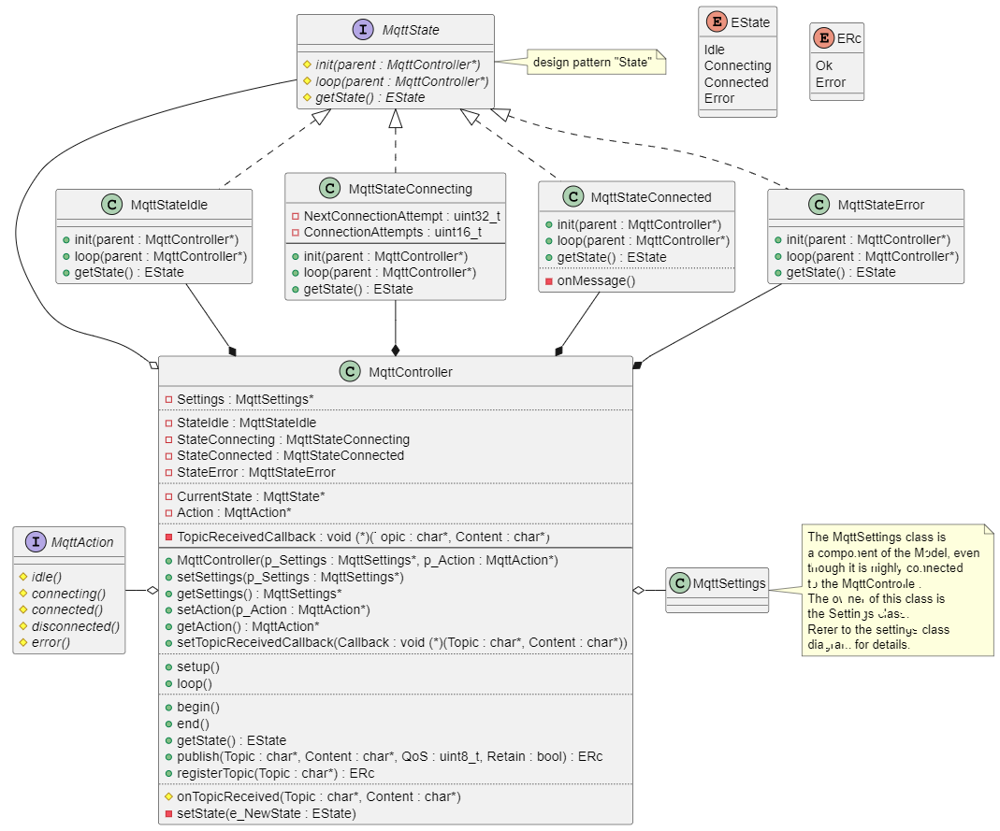

The MQTT controller state machine initializes in the idle state. To transition to the connecting state, the controller requires knowledge of the settings class, conveyed either through the constructor or the `setSettings()` method. The connection process is initiated by calling the `begin()` method. This is done in the implementation of the `WifiAction::connected()` method.

Within the `loop()` method, the controller attempts to connect to the MQTT broker. Upon successfully establishing a connection, the state transitions to the connected state and remains in this state as long as the connection is active. In the event of a connection loss, the controller reverts to the connecting state.

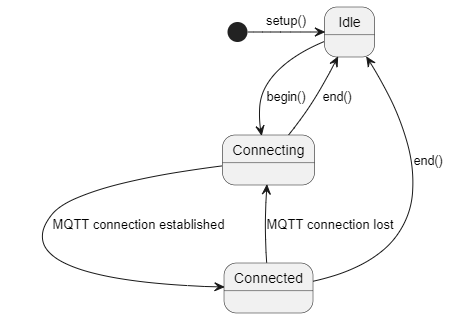


# Bootup process

Upon device startup, the construction of all globally declared classes is initiated. It is noteworthy that the constructors of these classes exclusively entail the execution of initialization code, without the inclusion of functional operations.

The utilization of the Arduino framework necessitates consideration of two fundamental functions: `setup()` and `loop()`. Following conventional practices, the RS232 connection is configured as a priority. Pertinent information, such as the project's name, the compilation date of the main function and information about the pin setup, is transmitted via the serial line. Subsequently, the setup methods of the facade classes associated with both the view and the controller are invoked. These methods perform the further configuration of the system, primarily involving the retrieval of settings from flash memory and their dissemination to the corresponding controllers. As the conclusive step in the setup phase, the activation of the connection state of the WIFI controller takes place.

It is crucial to acknowledge that preemptive multitasking is not employed within this IoT skeleton. Instead, a semi-parallel execution model is achieved by invoking the loop methods of all controllers and views. To ensure efficient management within these loop methods, the state machine design pattern is utilized (see above for details).

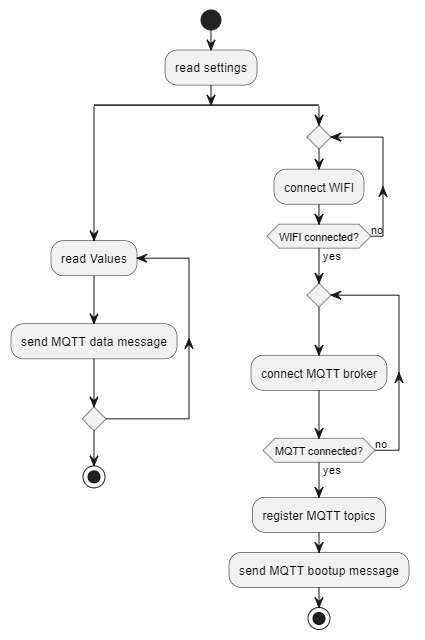


# Directory structure

The source code is organized into three main directories. External libraries are housed in the "libdeps" directory. These libraries possess their own repositories and are imported during the compilation process.

Within the "lib" directory, one can find all controllers, models, and views implemented in a generic manner. This structure aims to facilitate testability through integration tests.

The "src" directory contains facade classes for controllers, models, and views, along with the software's entry point (main.cpp). Notably, the contents of this directory are excluded from compilation and linkage when executing integration tests.
  

# SOUP

The following 3rd party software components are part of the excutable and are handeled as a SOUP (software of unknown provenance):

| Type | Software | Version | Manufacturer/Maintainer |
| ---- | -------- | ------- | ------------------------| 
| Platform (ESP8266 only) | espressif8266 | 4.2.0 | Espressif systems |
| Platform (ESP32 only) | espressif32 | 6.3.1 | Espressif systems |
| Package | framework-arduinoespressif32 | 3.20009.0 (2.0.9) | Espressif systems |
| Library | CRC | 1.0.2 | Rob Tillaart |
| Library | ArduinoMqttClient | 0.1.7 | Alexander Entinger |
| Library | ArduinoJson | 6.21.2 | Benoit Blanchon |
| Library | spin-timer | 3.0.0 | Dieter Niklaus |
| Library | Shell | 1.2.0 | Stefan Trippler |

# Development tools

The following tools and drivers are used for development:

| Type | Software | Version | Manufacturer/Maintainer |
| ---- | -------- | ------- | ------------------------| 
| OS | Windows 11 | latest | Microsoft |
| Driver | CP210x Universal Windws Driver | 11.2.0 | Silicon Labs | 
| Interpreter | Python | 3.10 | Python Software Foundation |
| IDE  | Visual Studio Code | 1.77.3 | Microsoft |
| IDE Extension | C/C++ | 1.18.3 | Microsoft |
| IDE Extension | PlatformIO IDE | 3.1.1 | PlatformIO |
| IDE Extension | PlantUML | 2.17.5 | yebbs |
| Toolchain | toolchain-xtensa-esp32 | 8.4.0+2021r2-patch5 | Espressif systems |
| Toolchain | tool-esptoolpy | 1.40501.0 (4.5.1) | PlatformIO |
| RCS | git | 2.40.0 | Junio Hamano |
| RCS | Git Extensions | 4.0.2 | Henk Mesthuis |
| Merge Tool | P4Merge | 2023.1/2419860 | Perforce |


# Additional information

## Create a new project based on this IoT skeleton application

To use *iot-arduino* as a template for a new project, it has to be forked locally.

1. On **GitHub:** Create a new repository, i.e. *my-iot-device*
   
1. Within a **Git Bash:**
   1. Clone the *iot-arduino* skeleton as a **bare repository**:
   ```bash
      git clone --bare https://erniegh@dev.azure.com/erniegh/ERNI-SmartFactory/_git/iot-arduino
   ```
   2. Replace origin with the one for your new project (i.e. project *my-iot-device*, with *your-name* as GitHub user name):
   ```bash
      cd ./iot-arduino.git
      git remote rm origin
      git remote add origin https://github.com/your-name/my-iot-device.git
   ```
   3. Push the bare repo as a **mirror** to your new origin:
   ```bash
      git push --mirror
   ```
   4. Clone the new project (i.e. project *my-iot-device*, with *your-name* as GitHub user name):
   ```bash
      cd ..
      git clone https://github.com/your-name/my-iot-device.git
   ```
   5. Remove the bare *iot-arduino* template project:
   ```bash
      rm -rf ./iot-arduino.git
   ```

